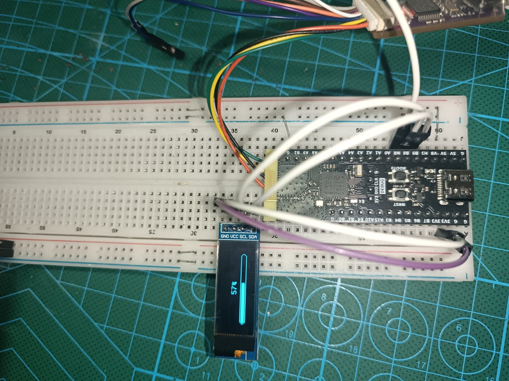

# SSD1306 I2C OLED on WeAct STM32WB55CGUx

Proyek STM32CubeIDE ini ditujukan untuk board WeAct STM32WB55CGUx dan modul OLED SSD1306 128x32 melalui antarmuka I2C.

## Deskripsi

- Board: WeAct STM32WB55CGUx
- OLED: SSD1306 128x32
- Antarmuka: I2C1
- Pin I2C:
  - SCL: PB8
  - SDA: PB9
- Transfer data cepat: DMA1 Channel 6 digunakan untuk I2C high-speed transfer.

Proyek ini mencakup konfigurasi HAL dan driver untuk mengendalikan tampilan OLED SSD1306 menggunakan I2C dengan DMA.

## Struktur Proyek

- `SSD1306_I2C_WEACT_WB55CG.ioc` - file konfigurasi STM32CubeMX / CubeIDE.
- `Core/Inc/` - header proyek utama dan konfigurasi perangkat.
- `Core/Src/` - sumber kode utama aplikasi dan startup.
- `Drivers/BSP/ssd1306/` - driver dan font untuk tampilan SSD1306.
- `Drivers/STM32WBxx_HAL_Driver/` - library HAL ST untuk STM32WB series.
- `Drivers/CMSIS/` - CMSIS core dan perangkat.
- `Startup/` - file startup dan linker script untuk STM32WB55CGUx.
- `Debug/` - file build dan debug dari CubeIDE.

## Fitur Utama

- Inisialisasi I2C1 untuk komunikasi dengan SSD1306
- Penggunaan DMA1 Channel 6 untuk mempercepat transfer I2C
- Driver SSD1306 untuk menampilkan teks dan grafis sederhana pada layar 128x32

## Catatan

- Pastikan koneksi hardware I2C pada pin PB8 (SCL) dan PB9 (SDA).
- Proyek ini diatur untuk STM32WB55CGUx, sehingga konfigurasi clock dan peripheral sesuai dengan MCU tersebut.
