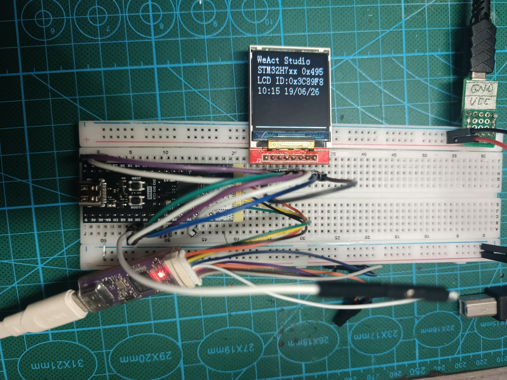

# STM32CubeIDE Project: Weact STM32WB55CGUx + ST7735 1.44" TFT LCD

Proyek ini adalah aplikasi STM32CubeIDE untuk board Weact STM32WB55CGUx yang terhubung dengan modul LCD TFT 1.44 inch 128x128 menggunakan driver ST7735.

## Deskripsi

Aplikasi ini menyiapkan lingkungan pengembangan STM32 menggunakan HAL dan BSP untuk menampilkan konten pada layar ST7735.
Proyek dapat berfungsi sebagai contoh atau basis untuk pengembangan GUI sederhana, menampilkan logo, teks, dan elemen grafis lainnya pada display TFT kecil.

## Perangkat Keras

- Board: Weact STM32WB55CGUx
- Display: LCD TFT ST7735, 1.44 inch, resolusi 128x128
- Pin SPI yang dipakai:
  - `SCK` = PA1
  - `CS` = PA2
  - `DC` = PA3
  - `MOSI` = PA7

## Struktur Proyek

- `ST7735_1.44_WEACT_WB55CG.ioc` - Konfigurasi proyek STM32CubeIDE.
- `ST7735_1.44_WEACT_WB55CG.launch` - Konfigurasi peluncuran/debug.
- `STM32WB55CGUX_FLASH.ld` / `STM32WB55CGUX_RAM.ld` - Skrip linker untuk memori flash dan RAM.

### `Core/`
- `Core/Inc/` - Header aplikasi utama.
  - `main.h` - Deklarasi fungsi dan konfigurasi global.
  - `stm32wbxx_hal_conf.h` - Konfigurasi HAL.
  - `stm32wbxx_it.h` - Deklarasi interrupt handler.
- `Core/Src/` - Kode sumber aplikasi utama.
  - `main.c` - Program utama.
  - `stm32wbxx_hal_msp.c` - Inisialisasi board dan peripheral.
  - `stm32wbxx_it.c` - Handler interrupt.
  - `syscalls.c` / `sysmem.c` - Implementasi sistem minimal untuk semihosting / retargeting.
  - `system_stm32wbxx.c` - Inisialisasi sistem clock dan konfigurasi perangkat.
- `Core/Startup/` - File startup assembly untuk STM32WB55CGUx.

### `Drivers/`
- `Drivers/BSP/ST7735/` - Board Support Package untuk display ST7735.
  - `lcd.c`, `lcd.h` - Abstraksi tampilan LCD.
  - `st7735.c`, `st7735.h` - Driver ST7735 SPI dan perintah kontrol.
  - `st7735_reg.c`, `st7735_reg.h` - Register dan konfigurasi spesifik ST7735.
  - `font.h` - Definisi font untuk tampilan teks.
  - file logo (`logo_128_128.c`, `logo_128_160.c`, `logo_160_80.c`) - Data gambar untuk ditampilkan.
- `Drivers/CMSIS/` - Library CMSIS untuk ARM Cortex-M.
- `Drivers/STM32WBxx_HAL_Driver/` - HAL driver STM32WBxx.

### `Debug/`
- Folder debugging yang berisi makefile, daftar sumber, dan file objek hasil kompilasi.

## Fungsi Utama

- Inisialisasi mikrokontroler STM32WB55CGUx.
- Inisialisasi dan komunikasi SPI dengan modul ST7735.
- Pengendalian tampilan TFT 128x128 untuk menampilkan teks, grafik, dan logo.
- Basis untuk pengembangan aplikasi visual pada board STM32.

## Catatan

Proyek ini cocok digunakan sebagai referensi untuk:
- Integrasi display ST7735 dengan STM32.
- Struktur aplikasi STM32CubeIDE berbasis HAL.
- Prototipe antarmuka pengguna sederhana pada perangkat embedded.

## Demo BMP

Untuk demo `draw BMP` diperlukan file BMP 16-bit dengan ukuran 128x128 pixel.
File BMP tersebut dapat diubah menjadi array C menggunakan `Bin2C.exe` yang tersedia di folder proyek ini.
Pastikan gambar dikonversi ke format yang sesuai agar dapat ditampilkan di layar ST7735.
